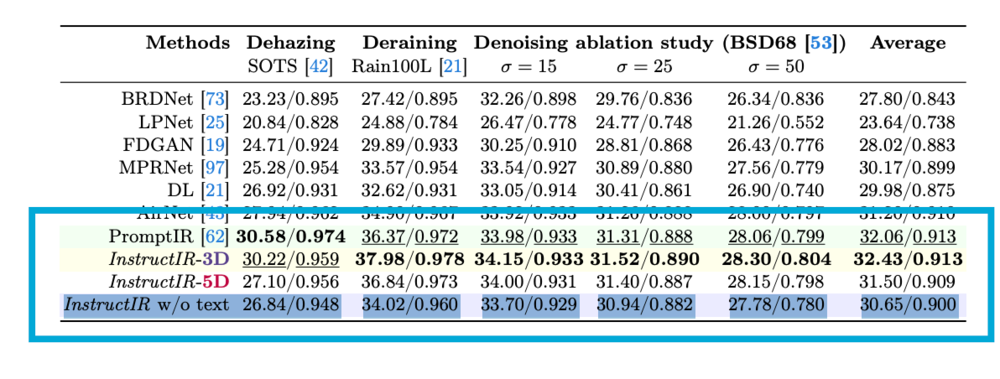
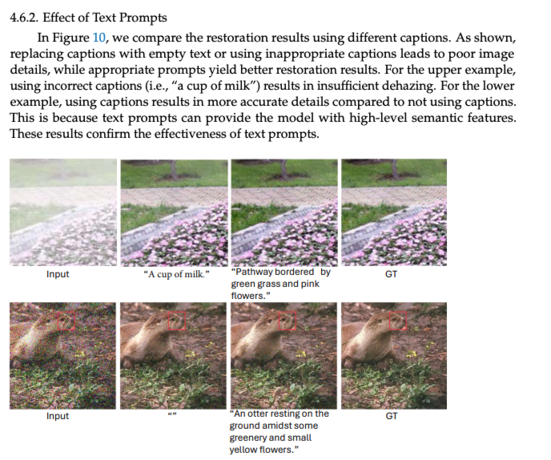
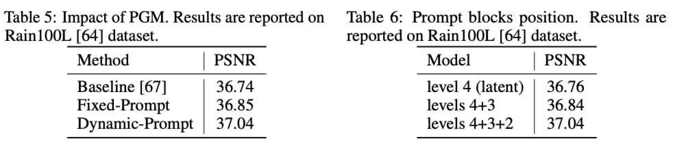

# 论文复现

由于服务器坏了,在 autoDL 上复现InstructIR_5D,然后花时间解决了一下 autoDL 环境问题还有 5D 代码和数据集缺失问题

1. InstructIR_5D的14轮的效果 但由于 autoDL的系统盘只有30G,中间由于系统盘满了所以训练停止了

| Method                | InstructIR_5D | me             |
| ----------------------- | --------------- | ---------------- |
| Dehazing on SOTS      | 27.10 / 0.956 | 28.97 / 0.9655 |
| Deraining on Rain100L | 36.84 / 0.973 | 34.25 / 0.9565 |
| Denoising (σ=25)     | 31.40 / 0.887 | 30.70 / 0.8723 |
| Deblurring on Gopro   | 29.40 / 0.886 | 28.14 / 0.8565 |
| Low-light Enh. on LOL | 23.00 / 0.836 | 22.08 / 0.8171 |

1. IDR 方面,由于为了后续在方便在训练机上训练,所以在跳板机上配的环境,但是由于跳板机的环境变量等设置有问题,conda pack 打包环境一直很多包打包不进去,由于 conda Install 不支持 requirements.txt 而且 conda install slove 时间过长,然后用的 pip install,但是会安装到用户环境下,所以导致pack 不到,然后这个现象在之前其他项目环境也出现过,遂花费大量时间在排查问题,后续修改环境文件解决

# 横向项目

本周主要做了要跟此芯对接的PPT

# InstructIR3D训练过程的复盘

背景:InstructIR的 3D 版本代码编写错误,导致训练过程 prompt 输入为空,然后 derain 任务差距在 10 个点以上,差距非常大,后续修复代码后, derain 任务的指标也有了显著提升,接近目标值.本周主要找了相关的 prompt 对图像修复影响的论文读了一下,发现 prompt 对图像修复影响是相对比较大的,而且 derain 任务影响比dehaze 和 denoise 任务的影响要大.但是 derain 在这些论文放里面derain影响多为 2-4 个点,在 dehaze 和 derain在一个点左右.与之前的实验过程中差异比较大,但是论文中细节很多都未提及.就是这个有无 prompt 和 prompt 对比,是训练过程都没加还是最后推理的时候才没加.

1. **去噪、去雾任务：Prompt影响小**
   因噪声（如高斯噪声）有明确零均值均匀分布、雾符合大气散射模型（全局朦胧低频），降质特征在图像中规律且易识别，模型仅凭视觉特征+降质分类头即可盲复原，无需Prompt额外指引。
2. **去雨任务：Prompt影响大**
   因雨条纹形态无规律（角度、长度、密度随机），且易与场景细节（树枝、电线）混淆，模型仅凭视觉难区分“雨迹”与“真实纹理”；Prompt可明确告知“需去除雨降质”，提供语义先验，帮模型聚焦雨迹区域，避免误判或残留。
   下面是看的相关论文里面内容
   论文PDF在当前的文件夹中,如需自取

   InstructIR 论文里面图,对于这个 w/o 没有说明
   

De-raining Natural Scenes using Diffusion Models
这个里面提及

> As shown, replacing captions with empty text or using inappropriate captions leads to poor image details, while appropriate prompts yield better restoration results.

如所示，将描述替换为空文本或使用不恰当的描述会导致图像细节变差，而使用恰当的提示能得到更好的复原结果。

还有在论文Universal Image Restoration with Text Prompt Diffusion第 4.6.2 节

PromptIR论文中

1. **Baseline (基线模型)** ：这可以看作是“无 prompt”的情况。它使用的是原始的 Restormer [67] 模型，**没有**加入 PromptIR 提出的任何提示模块。
2. **Fixed-Prompt (固定提示)** ：这是“有 prompt”但提示是静态的情况。它加入了提示模块，但提示是固定的、可学习的参数，不会根据输入图像的内容动态变化。
3. **Dynamic-Prompt (动态提示)** ：这是完整的 PromptIR 方法。它不仅加入了提示模块，还通过 PGM (Prompt Generation Module) 根据输入图像动态地生成提示。

下周进度:

1. IDR 代码的编写和后续调试
2. 训练集修复好后,完成InstructIR5D的训练工作
3. 项目方面看对接后学姐的安排继续推进
