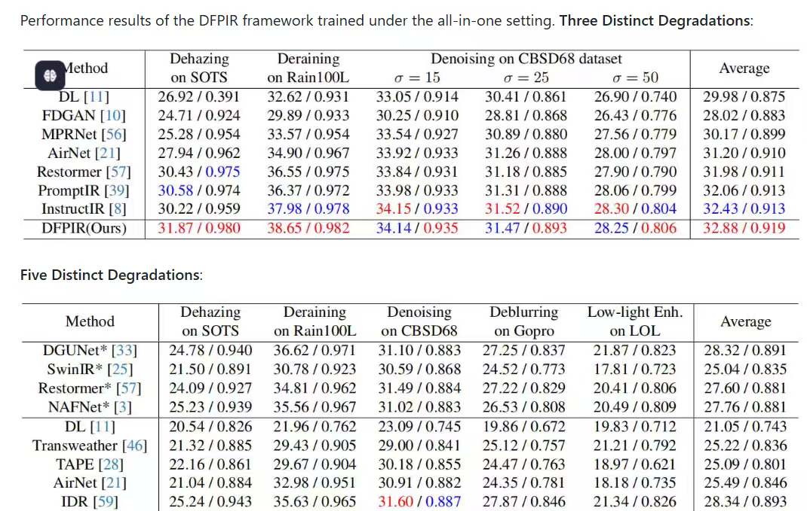

# 本周进度

##  论文复现相关

1. InstructIR 
跑了80 轮 epoch 的结果

Weights: /home/ubuntu/StudentCodeSpace/codespace/InstructIR/experiments/instructir_dfpir3d/model_best.pth.tar
PSNR -> denoise: 33.84/31.21/27.96, derain: 25.52, dehaze: 29.58, avg: 29.62
SSIM -> denoise: 0.9319/0.8871/0.7955, derain: 0.8140, dehaze: 0.9741, avg: 0.8805
psnr15=33.8365, ssim15=0.9319
psnr25=31.2062, ssim25=0.8871
psnr50=27.9580, ssim50=0.7955
psnr_rain=25.5221, ssim_rain=0.8140
psnr_haze=29.5814, ssim_haze=0.9741

2. Restormer
目前还在调试环境,当前对于 cuda 兼容还是有点问题,代码在 cpu 基本可以运行

## 项目相关

由于之前调研时提前找了模型的ONNX版本
然后目前延续学姐思路再找一个大而全的框架 
ESPNet2, 目前租了个 autodl 在配环境上有点问题